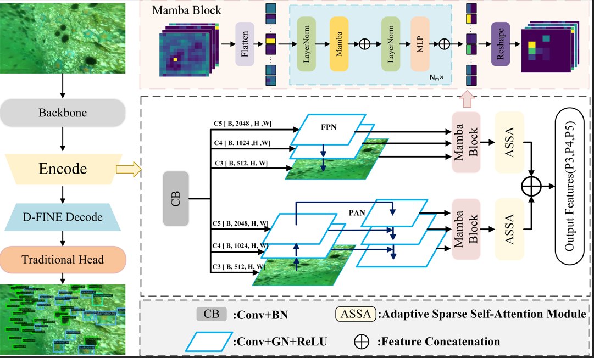
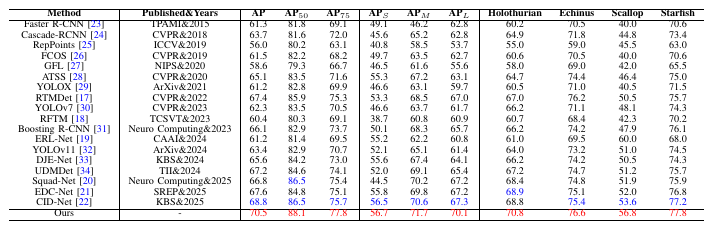

# MFPD: Mamba-Driven Feature Pyramid Decoding for Underwater Object Detection


## Introduction

Underwater object detection suffers from limited long-range dependency modeling, fine-grained feature representation, and noise suppression, resulting in blurred boundaries, frequent missed detections, and reduced robustness. To address these challenges, we propose the Mamba-Driven Feature Pyramid Decoding framework, which employs a parallel Feature Pyramid Network and Path Aggregation Network collaborative pathway to enhance semantic and geometric features. A lightweight Mamba Block models long-range dependencies, while an Adaptive Sparse Self-Attention module highlights discriminative targets and suppresses noise. Together, these components improve feature representation and robustness. Experiments on two publicly available underwater datasets demonstrate that MFPD significantly outperforms existing methods, validating its effectiveness in complex underwater environments.



## Dependencies

- Python == 3.10.18
- absl-py == 2.3.0
- accelerate == 1.8.1
- calflops == 0.3.2
- certifi == 2025.6.15
- charset-normalizer == 3.4.2
- colorama == 0.4.6
- contourpy == 1.3.2
- cycler ==  0.12.1
- einops ==  0.8.1
- faster-coco-eval == 1.6.7
- filelock ==  3.18.0
- fonttools == 4.58.4
- fsspec == 2025.5.1
- grpcio == 1.73.1
- huggingface-hub == 0.33.1
- idna == 3.10
- Jinja2 == 3.1.6
- kiwisolver == 1.4.8
- loguru ==  0.7.3
- Markdown == 3.8.2
- MarkupSafe == 3.0.2
- matplotlib == 3.10.3
- mpmath == 1.3.0
- narwhals ==  1.44.0
- networkx == 3.4.2
- numpy ==  2.2.6
- packaging == 25.0
- pandas == 2.3.0
- pillow == 11.2.1
- pip == 25.1
- plotly == 6.1.2
- protobuf ==  6.31.1
- psutil ==  7.0.0
- pyparsing == 3.2.3
- python-dateutil == 2.9.0.post0
- pytz ==  2025.2
- PyYAML == 6.0.2
- regex ==  2024.11.6
- requests == 2.32.4
- safetensors == 0.5.3
- scipy == 1.15.3
- setuptools == 78.1.1
- six == 1.17.0
- sympy ==  1.14.0
- tensorboard == 2.19.0
- tensorboard-data-server == 0.7.2
- tokenizers == 0.21.2
- torch == 2.7.1+cu118
- torchaudio == 2.7.1+cu118
- torchvision  == 0.22.1
- tqdm == 4.67.1
- transformers == 4.52.4
- typing_extensions == 4.14.0
- tzdata == 2025.2
- urllib3 == 2.5.0
- Werkzeug == 3.1.3
- wheel == 0.45.1
- win32_setctime ==  1.2.0

## Datasets

**DUO**: https://github.com/chongweiliu/DUO

**UTDAC2020**: https://drive.google.com/file/d/1avyB-ht3VxNERHpAwNTuBRFOxiXDMczI/view?usp=sharing


Other underwater datasets: https://github.com/mousecpn/Collection-of-Underwater-Object-Detection-Dataset

After downloading all datasets, create udmdet document.

```
$ cd data
$ mkdir mfpd
```

It is recommended to symlink the dataset root to `$data`.

```
udmdet
├── data
│   ├── DUO
│   │   ├── annotaions
│   │   ├── train2017
│   │   ├── test2017
```


## Train

```
$ CUDA_VISIBLE_DEVICES=1/2/3/4 python train.py -c configs/mfpd/mfpd_hgnetv2_l_DUO.yml --use-amp --seed=0 --device cuda
```
```
$ CUDA_VISIBLE_DEVICES=1/2/3/4 python train.py -c configs/mfpd/mfpd_hgnetv2_l_UTDAC.yml --use-amp --seed=0 --device cuda
```


## Results




## Acknowledgement

Thanks MMDetection team for the wonderful open source project!


